#项目笔记
视频地址：
https://www.bilibili.com/video/BV1bK411A7tV?p=12&spm_id_from=pageDriver

主要介绍多线程并发和多CPU并行

python并发编程有三种方式：多线程Thread、多进程Process、多协程Coroutine

c++/java都是先编译再执行，而python是边解释边执行，所以慢一点，但这里主要介绍GIL

多组件的Pipeline技术架构
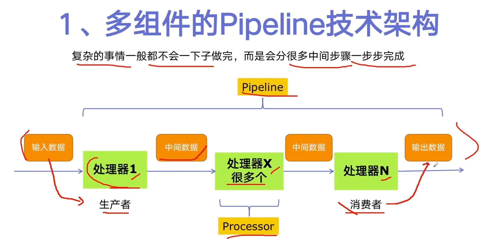

生产者消费者爬虫的架构
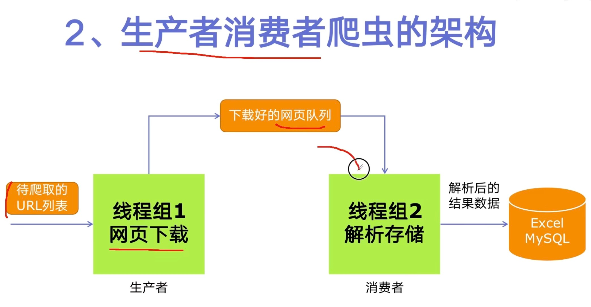

多线程数据通信的queue.Queue
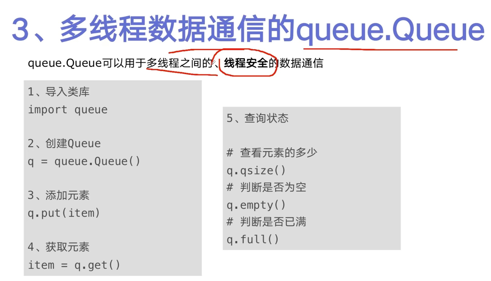

代码编写实现生产者消费者爬虫: 
见02.producer_consumer_spider.py

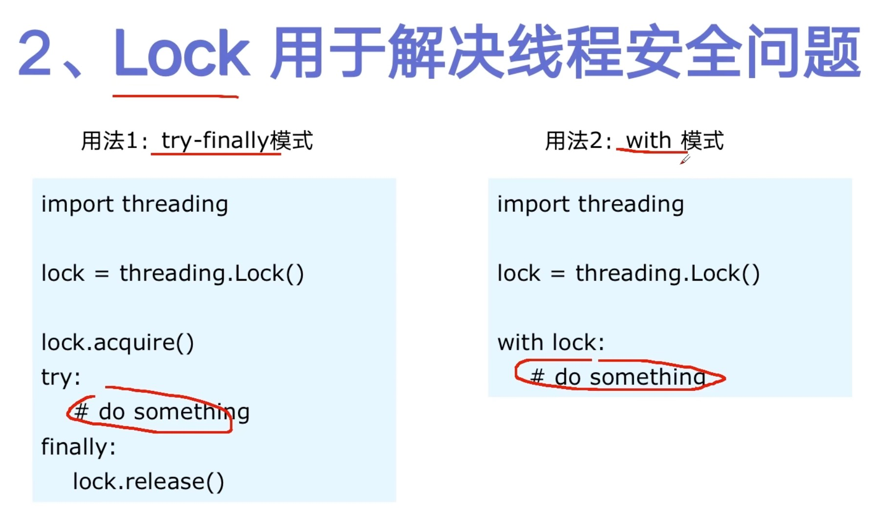

线程池的原理
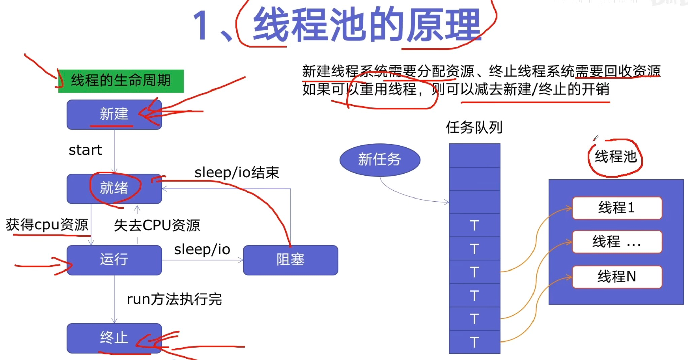

使用线程池的好处
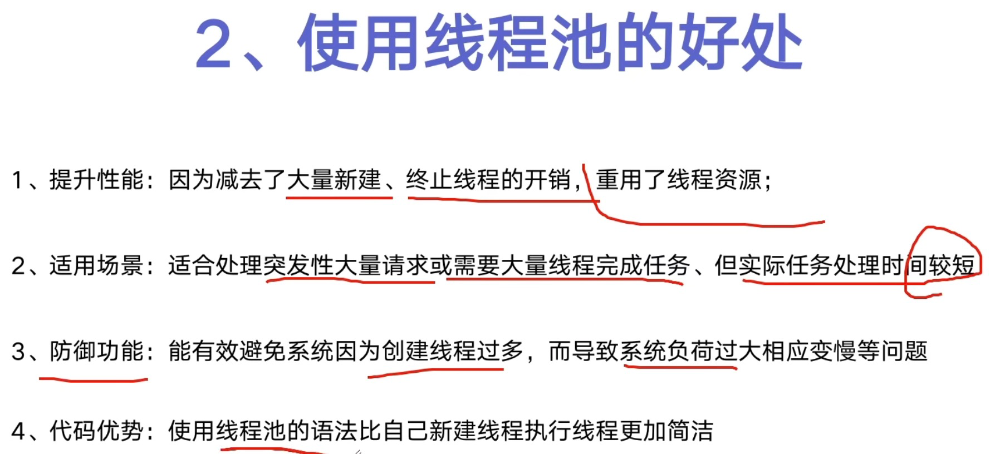

ThreadPoolExecutor的使用语法
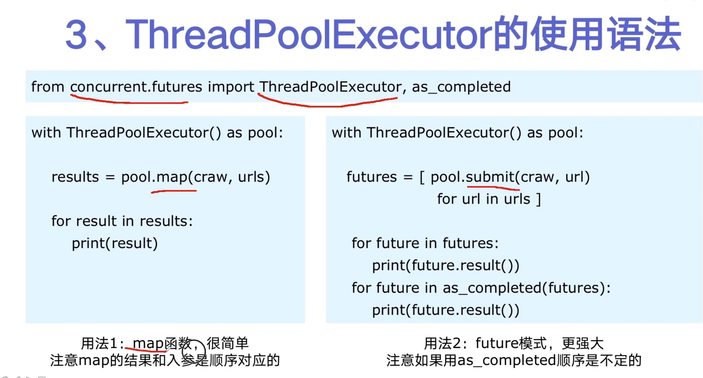

使用线程池改造爬虫程序
见04.thread_pool.py

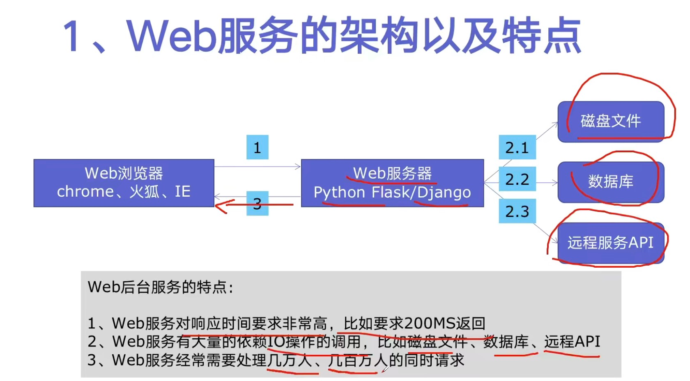

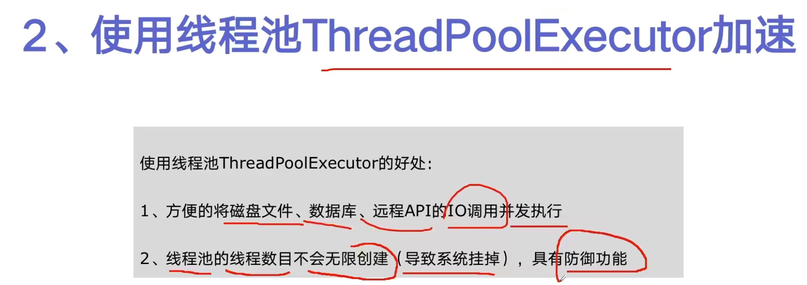

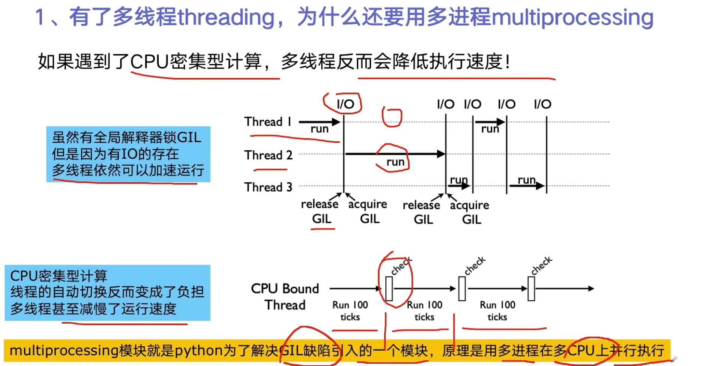

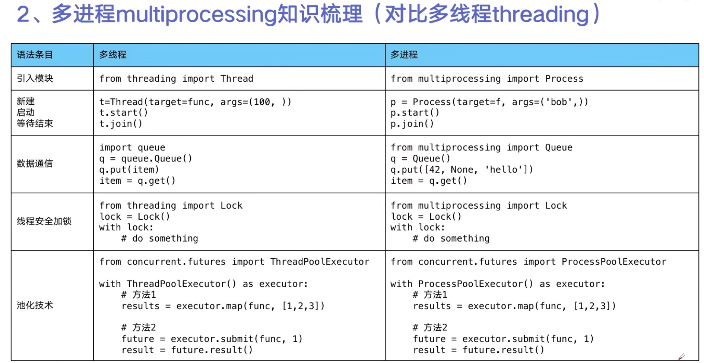

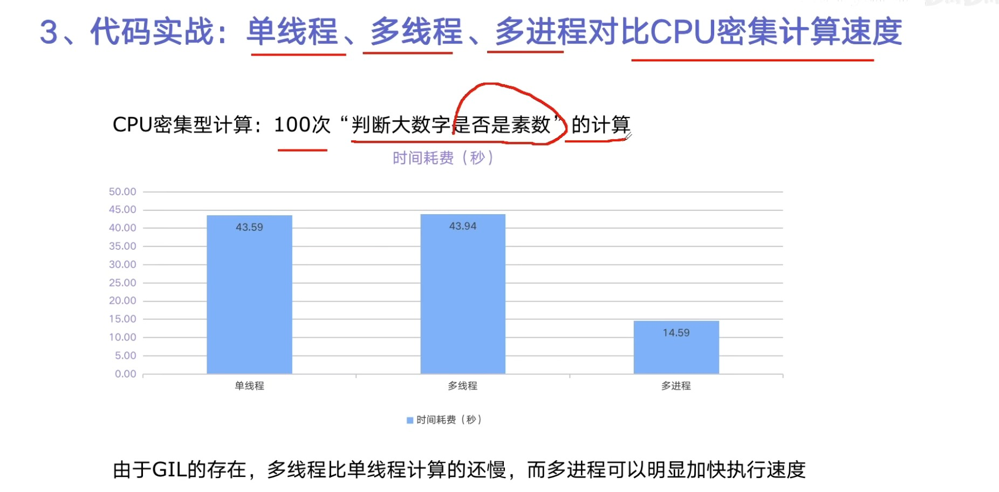

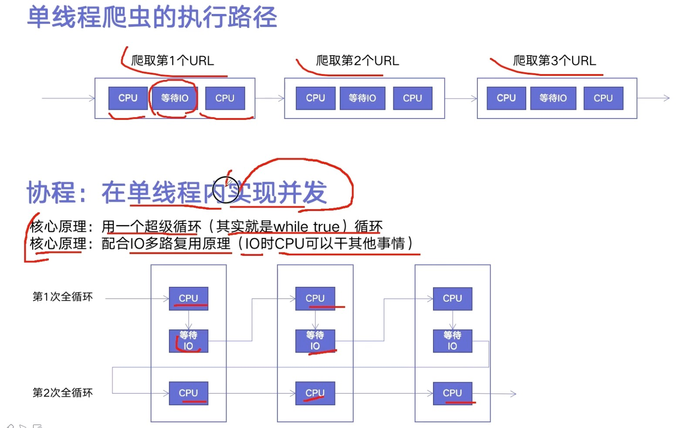

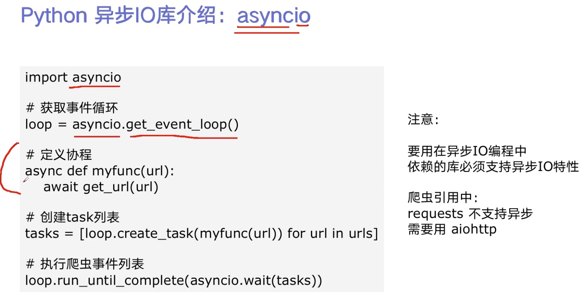

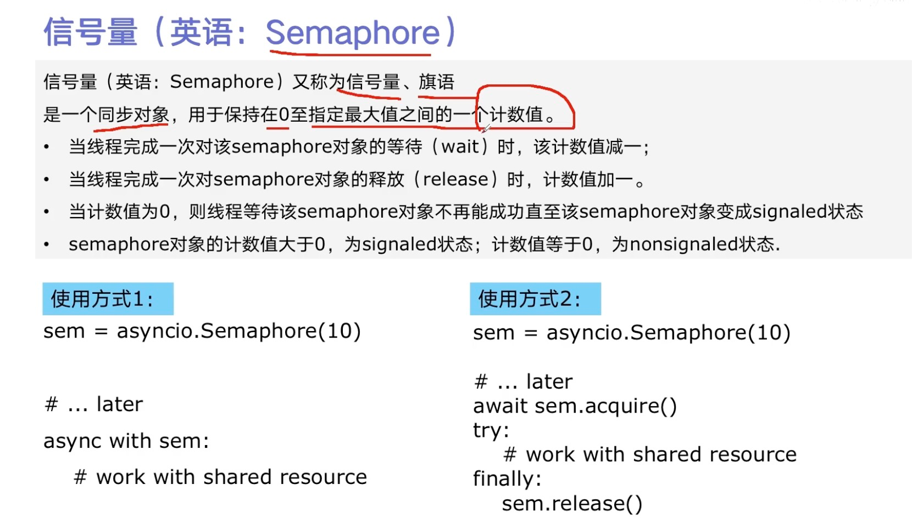